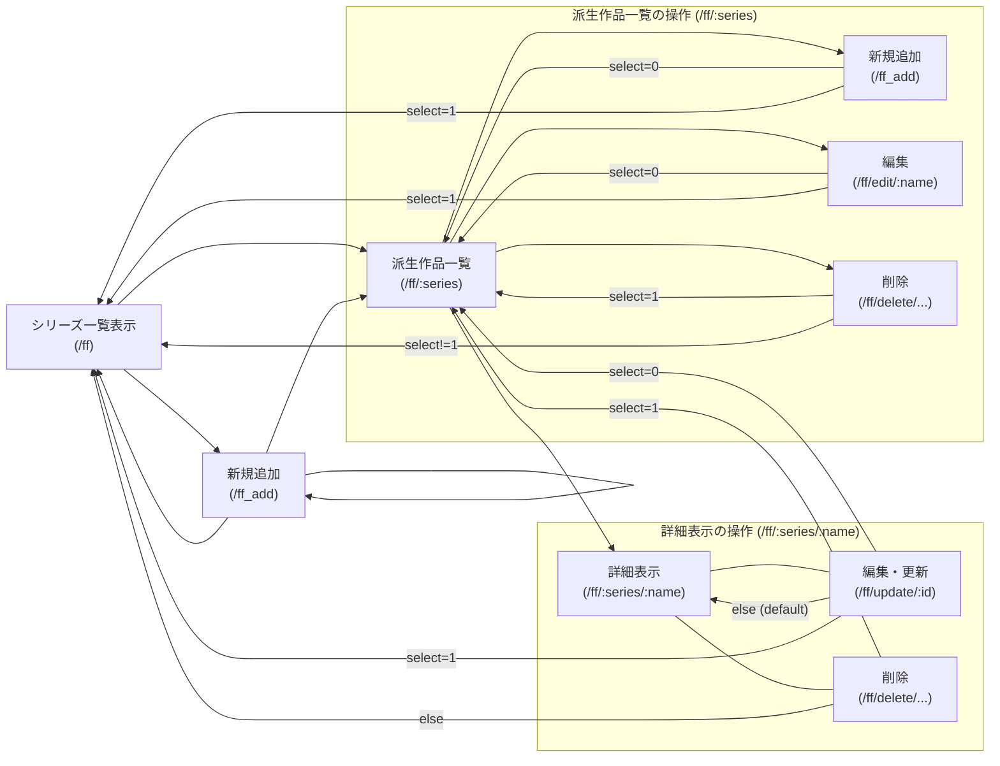

```mermaid
graph LR
    %% ページ構成 (ff.js のルーティングに基づく)
    A["シリーズ一覧表示<br/>(/ff)"]
    B["派生作品一覧<br/>(/ff/:series)"]
    C["詳細表示<br/>(/ff/:series/:name)"]

    %% メインフロー
    A --> B
    B --> C
    A --> add["新規追加<br/>(/ff_add)"]
    add --> A
    add --> B
    add --> add


    %% 派生作品一覧の操作（起点に戻る/リダイレクト）
    subgraph "派生作品一覧の操作 (/ff/:series)"
        direction TB
        addB["新規追加<br/>(/ff_add)"]
        editB["編集<br/>(/ff/edit/:name)"]
        delB["削除<br/>(/ff/delete/...)"]

        addB -- "select=0" --> B

        editB -- "select=0" --> B

        delB -- "select=1" --> B

    end
    addB -- "select=1" --> A
    editB -- "select=1" --> A
    delB -- "select!=1" --> A
    B ---> addB
    B ---> editB
    B ---> delB

    %% 詳細表示の操作（起点に戻る/リダイレクト）
    subgraph "詳細表示の操作 (/ff/:series/:name)"
        direction TB
        editC["編集・更新<br/>(/ff/update/:id)"]
        delC["削除<br/>(/ff/delete/...)"]

        editC -- "else (default)" --> C
        editC -- "select=0" --> B

        delC -- "select=1" --> B

    end
    editC -- "select=1" --> A
    delC -- "else" --> A
    C --- editC
    C --- delC
```