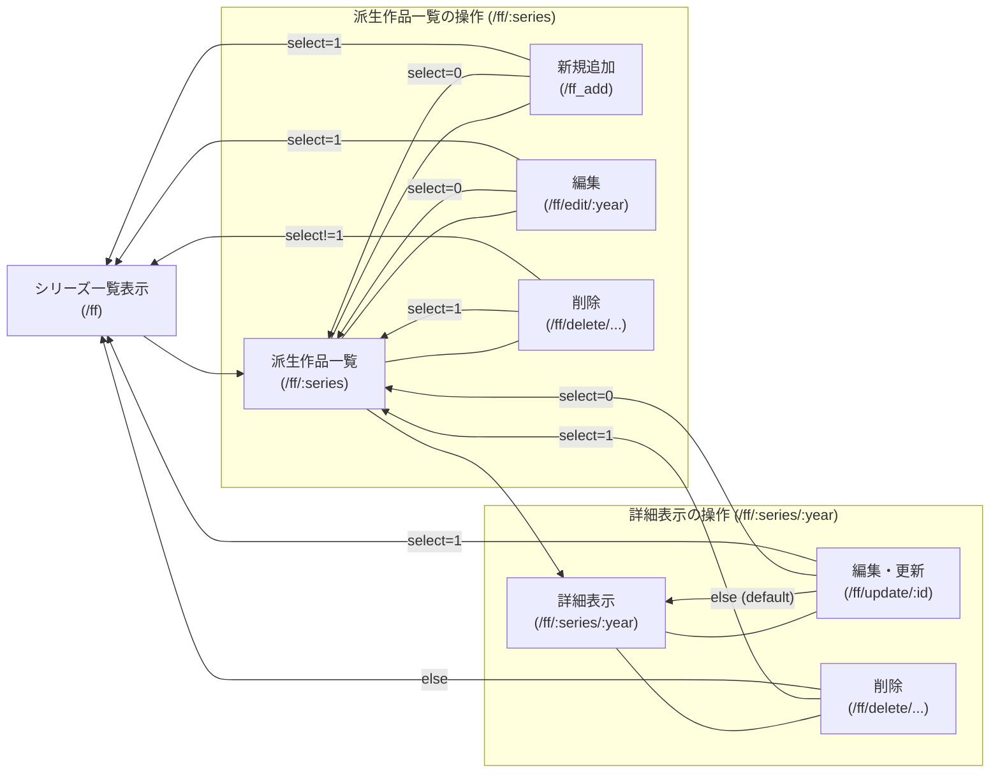
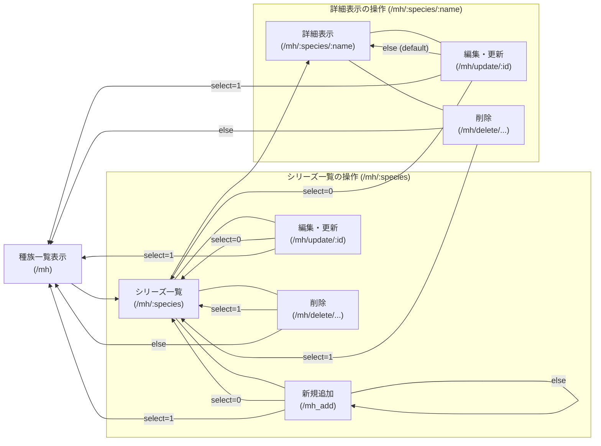
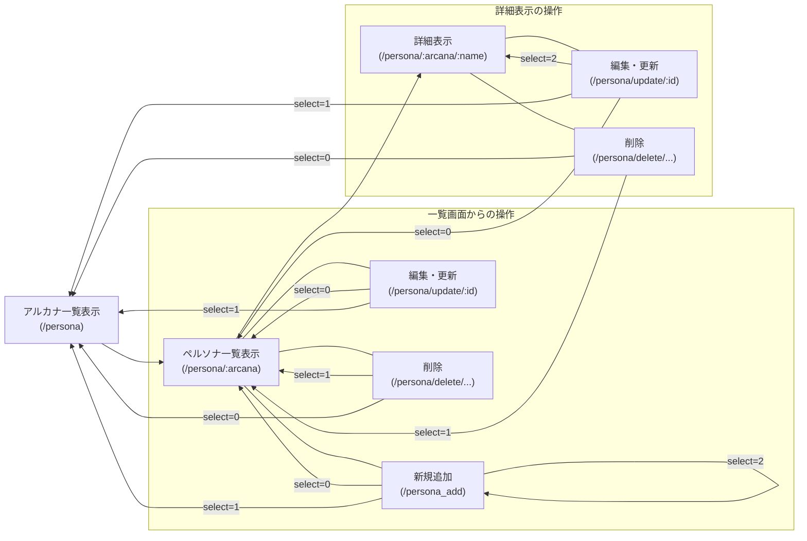

# FF のシステム

##　データ構造

| name                                       | id  | series             |  year   | main  | device                   | explanation               |
| :----------------------------------------- | :-: | :----------------- | :-----: | :---: | :----------------------- | :------------------------ |
| Final Fantasy                              |  1  | FinalFantasyI      | 1987-12 | true  | ファミリーコンピューター | FF シリーズ初タイトル     |
| Final Fantasy II                           |  2  | FinalFantasyII     | 1988-12 | true  | ファミリーコンピューター | 熟練度システム            |
| Final Fantasy III                          |  3  | FinalFantasyIII    | 1990-04 | true  | ファミリーコンピューター | 初のジョブシステム        |
| Final Fantasy XIII                         |  4  | FinalFantasyXIII   | 2009-12 | true  | PS3                      | オプティマシステム        |
| Final Fantasy XII-2                        |  5  | FinalFantasyXIII   | 2011-12 | false | PS3                      | FF13 の続編               |
| FINALFANTASYTACTICS THE IVALICE CHRONICLES |  6  | FinalFantasyothers | 2025-09 | false | PS5                      | タクティカル RPG の金字塔 |

## ページ遷移図

# モンハンアイスボーンのシステム

## データ構造

| id  | name           | species | week | resist     | invalid |
| --- | -------------- | ------- | ---- | ---------- | ------- |
| 1   | ディノバルド   | 獣竜種  | 水   | 雷         | 火      |
| 2   | ジンオウガ     | 牙竜種  | 氷   | 火　龍     | 雷      |
| 3   | イャンガルルガ | 鳥竜種  | 水   | 氷         | 火　雷  |
| 4   | ミラボレアス   | 古龍種  | 龍   | 水　雷　氷 | -       |

##　データ遷移図

# ペルソナのシステム

## データ構造

| id  | name             | arcana | week   | resist | invalid | reflection | absorption | example                                              |
| --- | ---------------- | ------ | ------ | ------ | ------- | ---------- | ---------- | ---------------------------------------------------- |
| 1   | ジャアクフロスト | 愚者   | 光     | -      | 火      | 闇         | 氷         | キングフロスト × ジャックランタン × ジャックフロスト |
| 2   | スルト           | 魔術師 | 氷     | -      | -       | -          | 火         | ジャターユ × ソロネ                                  |
| 3   | スカアハ         | 女教皇 | 火     | 風　光 | 氷      | -          | -          | ガルーダ × ガブリエル                                |
| 4   | アリラト         | 女帝   | 火　闇 | 風     | 氷      | 斬　打     | -          | サンダルフォン × スサノオ                            |
| 5   | オーディン       | 皇帝   | 風     | -      | -       | -          | 雷         | セイテンタイセイ × クヴァンダ                        |
| 6   | コウリュウ       | 法王   | -      | -      | 打      | -          | 雷         | ゲンブ × セイリュウ × ビャッコ × スザク              |

##　データ遷移図

