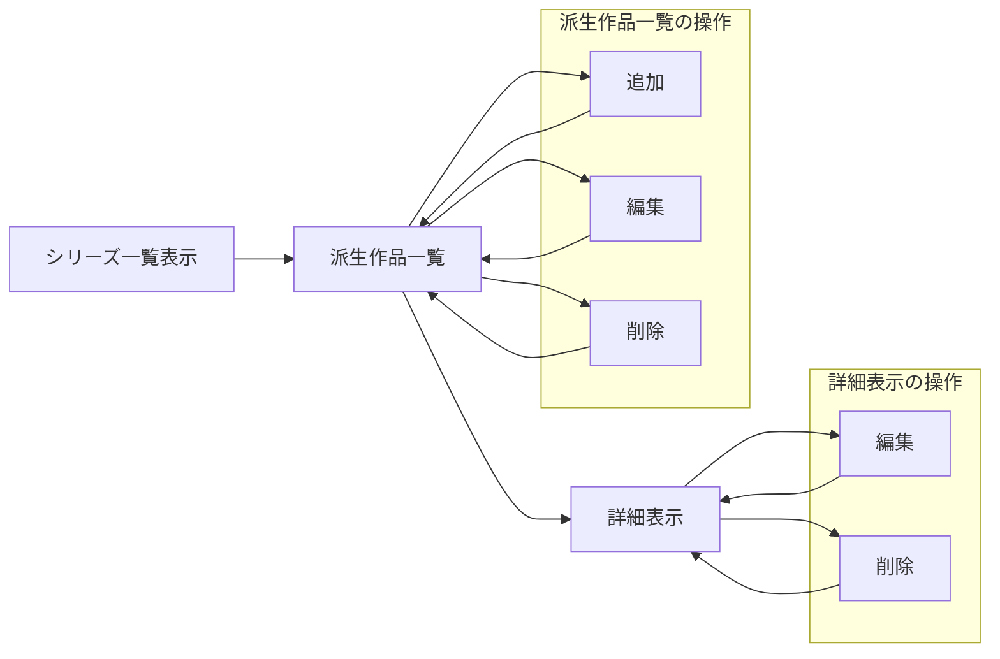

# FF のシステム

##　データ構造
id とシリーズ名とその中でのナンバリングで決定する
例として FF13-2 であれば，id=1，シリーズ名="FF13"，ナンバリング="2"となる．

| タイトル名            | id  | シリーズ名 | ナンバリング |
| --------------------- | --- | ---------- | ------------ |
| Final Fantasy         | 1   | FF1        | 1            |
| Final Fantasy II      | 2   | FF2        | 1            |
| Final Fantasy III     | 3   | FF3        | 1            |
| Final Fantasy XIII    | 4   | FF13       | 1            |
| Final Fantasy XIII-2  | 5   | FF13       | 2            |
| Final Fantasy Tactics | 6   | その他     | 1            |

## ページ遷移図

