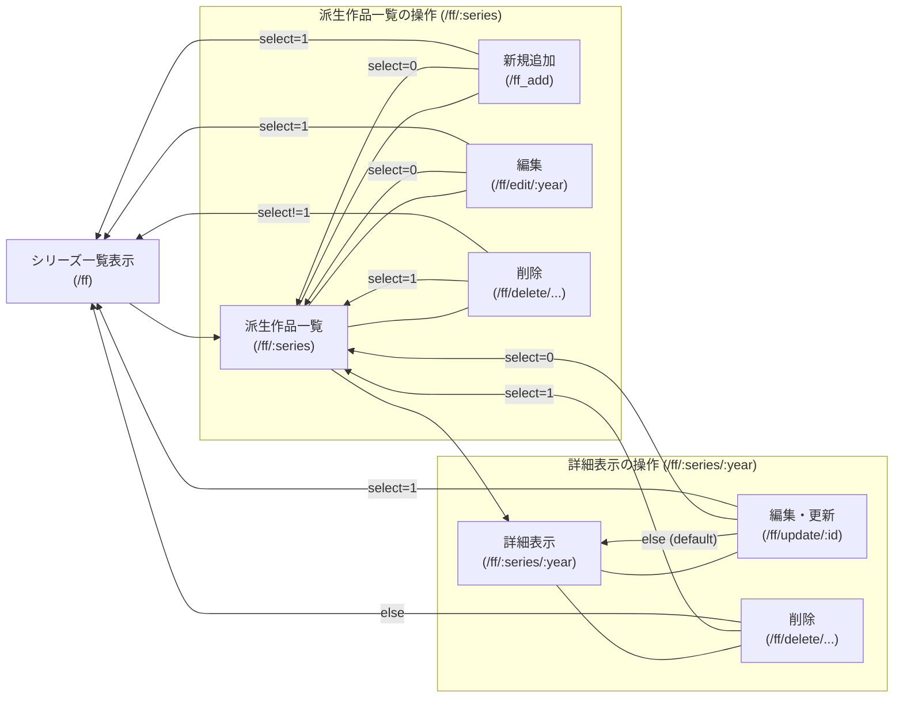

# FF のシステム

##　データ構造
id とシリーズ名とその中でのナンバリングで決定する
例として FF13-2 であれば，id=5，シリーズ名="FinalFantasyXIII"，ナンバリング="2"となる．

| タイトル名                                 | id  | シリーズ名         | 発売年月 | 一作目 | 対応ハード               | 説明                      |
| :----------------------------------------- | :-: | :----------------- | :------: | :----: | :----------------------- | :------------------------ |
| Final Fantasy                              |  1  | FinalFantasyI      | 1987-12  |  true  | ファミリーコンピューター | FF シリーズ初タイトル     |
| Final Fantasy II                           |  2  | FinalFantasyII     | 1988-12  |  true  | ファミリーコンピューター | 熟練度システム            |
| Final Fantasy III                          |  3  | FinalFantasyIII    | 1990-04  |  true  | ファミリーコンピューター | 初のジョブシステム        |
| Final Fantasy XIII                         |  4  | FinalFantasyXIII   | 2009-12  |  true  | PS3                      | オプティマシステム        |
| Final Fantasy XII-2                        |  5  | FinalFantasyXIII   | 2011-12  | false  | PS3                      | FF13 の続編               |
| FINALFANTASYTACTICS THE IVALICE CHRONICLES |  6  | FinalFantasyothers | 2025-09  | false  | PS5                      | タクティカル RPG の金字塔 |

## ページ遷移図

# モンハンアイスボーンのシステム

## データ構造

| id  | モンスター名   | 種族   | 弱点 | 耐性       | 無効   |
| --- | -------------- | ------ | ---- | ---------- | ------ |
| 1   | ディノバルド   | 獣竜種 | 水   | 雷         | 火     |
| 2   | ジンオウガ     | 牙竜種 | 氷   | 火　龍     | 雷     |
| 3   | イャンガルルガ | 鳥竜種 | 水   | 氷         | 火　雷 |
| 4   | ミラボレアス   | 古龍種 | 龍   | 水　雷　氷 | -      |

##　データ遷移図
