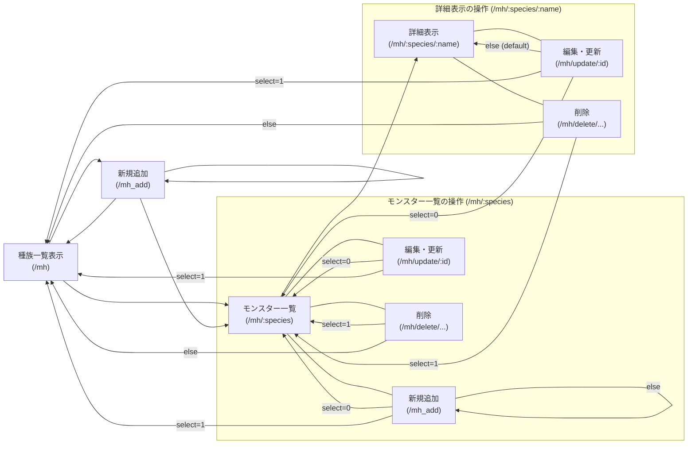

```mermaid
graph LR
    %% ページ構成 (mh.js のルーティングに基づく)
    A["種族一覧表示<br/>(/mh)"]
    B["モンスター一覧<br/>(/mh/:species)"]
    C["詳細表示<br/>(/mh/:species/:name)"]

    %% メインフロー
    A --> B
    B --> C
    A --> add
    add-->A
    add-->B
    add-->add
    add["新規追加<br/>(/mh_add)"]

    %% モンスター一覧における操作
    subgraph "モンスター一覧の操作 (/mh/:species)"
        direction TB
        addB["新規追加<br/>(/mh_add)"]
        editB["編集・更新<br/>(/mh/update/:id)"]
        delB["削除<br/>(/mh/delete/...)"]

        addB -- "select=0" --> B
        editB -- "select=0" --> B
        delB -- "select=1" --> B
    end

    addB -- "select=1" --> A
    addB -- "else" --> addB
    editB -- "select=1" --> A
    delB -- "else" --> A

    B --- addB
    B --- editB
    B --- delB

    %% 詳細表示における操作
    subgraph "詳細表示の操作 (/mh/:species/:name)"
        direction TB
        editC["編集・更新<br/>(/mh/update/:id)"]
        delC["削除<br/>(/mh/delete/...)"]

        editC -- "else (default)" --> C
        editC -- "select=0" --> B
        delC -- "select=1" --> B
    end

    editC -- "select=1" --> A
    delC -- "else" --> A

    C --- editC
    C --- delC
```