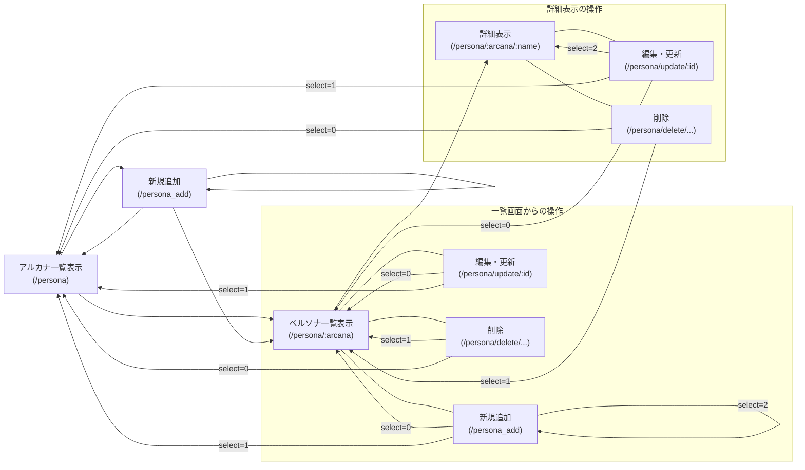

```mermaid
graph LR
    %% ページ構成
    A["アルカナ一覧表示<br/>(/persona)"]
    B["ペルソナ一覧表示<br/>(/persona/:arcana)"]
    C["詳細表示<br/>(/persona/:arcana/:name)"]

    %% メインフロー
    A --> B
    B --> C
    A-->addA
    addA -->A
    addA-->B
    addA-->addA
    addA["新規追加<br/>(/persona_add)"]

    %% アルカナ一覧/ペルソナ一覧からの操作
    subgraph "一覧画面からの操作"
        direction TB
        add["新規追加<br/>(/persona_add)"]
        editB["編集・更新<br/>(/persona/update/:id)"]
        delB["削除<br/>(/persona/delete/...)"]

        add -- "select=0" --> B
        editB -- "select=0" --> B
        delB -- "select=1" --> B
    end

    add -- "select=1" --> A
    add -- "select=2" --> add
    editB -- "select=1" --> A
    delB -- "select=0" --> A

    B --- add
    B --- editB
    B --- delB

    %% 詳細表示からの操作
    subgraph "詳細表示の操作"
        direction TB
        editC["編集・更新<br/>(/persona/update/:id)"]
        delC["削除<br/>(/persona/delete/...)"]

        editC -- "select=2" --> C
        editC -- "select=0" --> B
        delC -- "select=1" --> B
    end

    editC -- "select=1" --> A
    delC -- "select=0" --> A

    C --- editC
    C --- delC

```